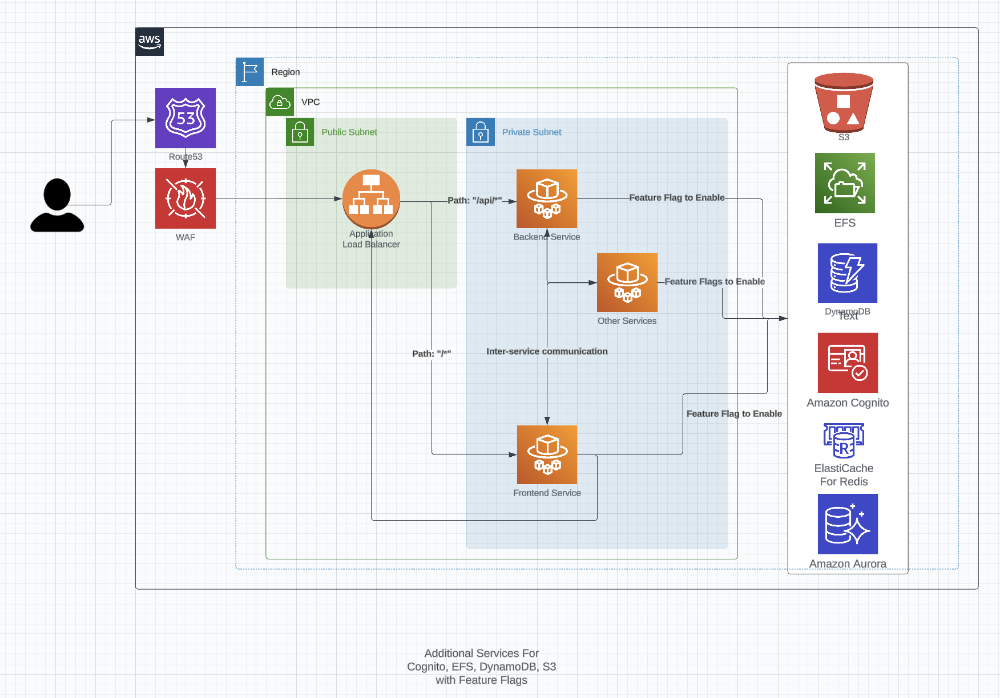

# CDK INFRASTRUCTURE

The CDK infrastructure deploys the following items:
- 1 ALB
- 1 Elastic Container Service (ECS) with 2 services (Frontend and Backend)
- 1 S3 Data Bucket accessible by the backend service
- 1 DynamoDB Table accessible by the backend service
- 1 S3 Logs Bucket for ALB logging
- 1 Log Group to stream logs from the frontend and backend services

The CDK stack, for this solution, does not deploy:
- Elastic Container Registry repositories (see [ECR Repository Creation](#ecr-repository-creation))

The following image shows the deployed infrastructure:



<!-- TODO: remove when WAF is implemented -->
**NOTE:** WAF and Route 53 have not yet been implemented as of August 28th, 2024

You can utilize https://us-east-1.console.aws.amazon.com/cloudformation/designer/home?region=us-east-1# to preview the generated template.


## ECR Repository Creation

Docker images are stored in repositories in the [Elastic Container Registry](https://docs.aws.amazon.com/AmazonECR/latest/userguide/Repositories.html). The images are given names based on [semantic versioning](https://github.com/marketplace/actions/git-semantic-version) on a commit level in Git, which cannot be performed by the AWS CDK. 

The creation of Docker images and ECR repositories are done through GitHub Actions. This allows for the Docker images to be named and versioned on a commit level.

For more information on the creation of ECR repositories, Docker images, and the deployment strategy, visit [this Confluence article.](https://toyotaresearchinstitute.atlassian.net/l/cp/Qu5e2XRs) 

## Python CDK Instructions

The `cdk.json` file tells the CDK Toolkit how to execute your app.

This project is set up like a standard Python project.  The initialization
process also creates a virtualenv within this project, stored under the `.venv`
directory.  To create the virtualenv it assumes that there is a `python3`
(or `python` for Windows) executable in your path with access to the `venv`
package. If for any reason the automatic creation of the virtualenv fails,
you can create the virtualenv manually.

To manually create a virtualenv on MacOS and Linux:

```
$ python3 -m venv .venv
```

After the init process completes and the virtualenv is created, you can use the following
step to activate your virtualenv.

```
$ source .venv/bin/activate
```

If you are a Windows platform, you would activate the virtualenv like this:

```
% .venv\Scripts\activate.bat
```

Once the virtualenv is activated, you can install the required dependencies.

```
$ pip install -r requirements.txt
```

At this point you can now synthesize the CloudFormation template for this code.

```
$ cdk synth
```

To add additional dependencies, for example other CDK libraries, just add
them to your `setup.py` file and rerun the `pip install -r requirements.txt`
command.

## Useful commands

 * `cdk ls`          list all stacks in the app
 * `cdk synth`       emits the synthesized CloudFormation template
 * `cdk deploy`      deploy this stack to your default AWS account/region
 * `cdk diff`        compare deployed stack with current state
 * `cdk docs`        open CDK documentation

Enjoy!
